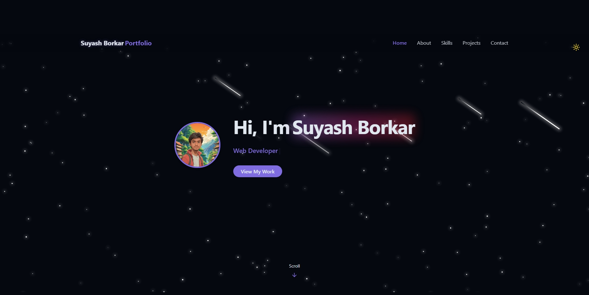
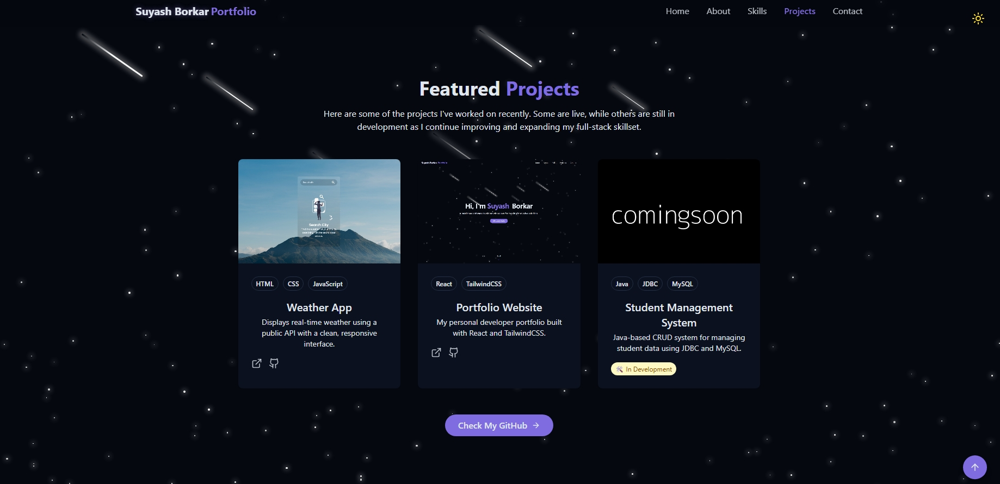

# 💼 Suyash Borkar – Developer Portfolio

Welcome to my personal developer portfolio website built with **React**, **Tailwind CSS**, and **modern animations**. This site showcases my skills, projects, interests, and more.

## 🌐 Live Demo

👉 [View Live Portfolio](https://personal-portfolio-alpha-three-16.vercel.app/)

---

## 🖼️ Screenshots




---

## 🚀 Tech Stack

- **React**
- **Tailwind CSS**
- **Lucide Icons**
- **Typewriter Effect (react-simple-typewriter)**
- **Vite**

---

## ✨ Features

- 🚀 Responsive design across all devices
- 🎨 Light & Dark mode toggle
- 🧠 Animated typewriter in Hero section
- 💬 Contact form integration (EmailJS or other)
- 🔍 ScrollSpy navigation
- 🌠 Custom meteor/star animated background

---

## 📁 Folder Structure (Simplified)

```bash
src/
├── components/
│   ├── Navbar.jsx
│   ├── HeroSection.jsx
│   ├── AboutMe.jsx
│   ├── SkillsSection.jsx
│   ├── ProjectsSection.jsx
│   ├── Footer.jsx
│   ├── Contact.jsx
├── assets/
│   ├── profile.jpg
│   └── project1.jpg
├── App.jsx
└── index.css
